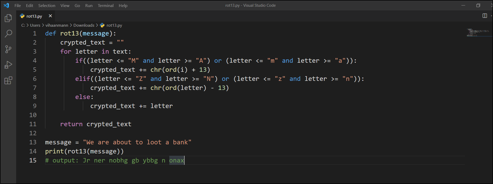

<h1 align="center">ROT13</h1>

ROT13 is an abbreviation for **Rotate by 13 places**. It is a special
case of Caesar cipher where we shift each letter by 13 places to either
encrypt our message or decrypt our message.

### Drawback

Since it only makes the use of 13 place shifting, it is not a secure
cipher and doesnot have any practical use as it can be decrypted very
easily.

### Python Program for Rot13

#### Explaination to the code:

1.  We tooked the string and sent it to rot13 function.
2.  Inside the function we have initialized an empty string
    "crypted\_text" which will be our crypted text version of the
    message.
3.  We ran a loop through the string and check for each character.
    -   "ord" function is used to get the ascii value of the character
        passed to it.
    -   We are then shifting the letter by 13 places.
    -   We are getting the character back from the passed ascii value
        using the "chr" function.
    -   If the letter is not an alphabet, we are directly concatenating
        it to the "crypted\_text" string.

4.  We are finally returning the crypted text and printing it.

