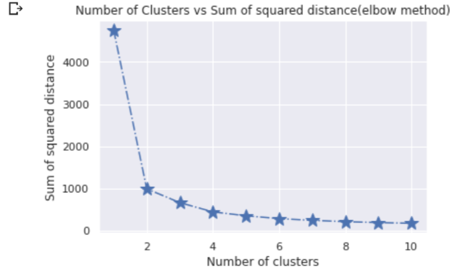

# Elbow Method In KMeans Clustering
## Video link: 
Clustering is an unsupepervised learning method in which we form the dataset into cluster of items or group of items on the basis of similarity or dissimilarity between the items or objects. In other words, we form groups several groups of items or objects such that each group has its the similar items/objects while rest of the items which are dissimilar are in some other group. In an unsupervised method, we are not given any pre defined labels and we have to infer the given dataset to form labelled sets. Same is being done here. We will not be given any predefined label and we have to label our clusters in such a way that all similar objects should be toegther in each cluster and the data point from different cluster should be as different as possible.  
Now, there is another thing which is important to find, that is the number of clusters, for which there is a method, known as Elbow method, that I will be covering.
## K Means Clustering
K-means is a clustering algorithm which is centroid-based or we can say is based on the center point of each cluster, along with distance-based or we can say the distance between the cluster center explained above and points in a cluster , where we calculate the distances to assign a point to a cluster. In K-Means, each cluster is represented by a centroid or the cluster mean.  
Now, to find clusters we will be using Elbow Method.


Example: Let us consider the example of a courier company which is currently having only one delivery center in a town/village. Now, the load on that delivery center is increasing as the parcels and letters are incoming and outgoing. The company wants to make few more centers so that they each center can target its own neighbourhood which is very near and doesn't need to interfere with parcels intended for other locality which is nearer to some other center. How can company do this? Here comes the k means clustering to rescue. The company will first see how many delivery center does it want in the town/village to form clusters that will be several areas and each cluster's centroid will be the delivery center. This finding of number of delivery centers is done with the help of Elbow method.

For implementing KMeans, we use
```
from sklearn.clusters import KMeans
``` 
and to build model we use,

```
kmeans=KMeans(n_clusters=i,init='k-means++',max_iter=300,n_init=10)
```

Now to find this n_clusters, we use Elbow mwthod.

## Elbow method
The elbow method helps to choose the optimum value of ‘k’ (number of clusters) by fitting the model with a range of values of ‘k’. We calculate the sum of squared distance(SSD) of each object from its cluster center, and from that, we find the number until which sharp changes in SSD are occurring. Through this, are finding the number of clusters through which even after increasing the number of clusters, doesnt make a significant difference or in other words, we are finding clusters for which increasing cluster centers does not bring significant difference in SSD. This point seems like an elbow and is the required number of k we want, and thus the method is named as elbow method.
#### Implementing Elbow Method

Importing necessary libraries
```
import pandas as pd
import matplotlib.pyplot as plt
import seaborn as sns
sns.set()
import numpy as np
from sklearn.cluster import KMeans
```

Reading csv file
```
data=pd.read_csv('california_cities.csv')
data.head(10)
```


Plotting scatter plot for unclustered data

```
plt.scatter(data['longd'],data['latd'])
plt.ylabel('Latitude')
plt.xlabel('Longitude')
plt.title('California cities latitude and longitude')
plt.show()
```


Selecting latitude and longitude columns to apply k means 
```
x=data.iloc[:,1:3]
x.head()
```


```
ssd=[]
for i in range(1,11):
    kmeans=KMeans(n_clusters=i,init='k-means++',max_iter=300,n_init=10)
    kmeans.fit(x)
    ssd_iter=kmeans.inertia_
    ssd.append(ssd_iter)
```

By above steps, we are finding the sum of squared distance of each point from its respective cluster center. Now, we will plot this values.
```
number_clusters=range(1,11)
plt.plot(number_clusters,ssd,marker='*',linestyle='-.',markersize=15)
plt.title('Number of Clusters vs Sum of squared distance(elbow method)')
plt.xlabel('Number of clusters')
plt.ylabel('Sum of squared distance')
plt.show()
```

From above plot, we can see that number of clusters equals 2 seems like shape of an elbow, hence its optimal number of clusters we want and there is no significant difference in SSD for n_clusters equals 2 and 3. Hence, we building model with n_clusters=2.

Through this we were able to form n_clusters in implementing k means algorithm easily with help of elbow method.

## Advantage and Disadvantage of Elbow method
- Advantage: Through this method, we are able to find the optimum number of clusters, which is diffcult task in K Means clustering algorithm and this particular task of finding number of clusters is considered to be a disadvantage of K Means algorithm, which is overcomed by elbow method.
- Disadvantage: The presence of multidimensional data and/or outliers affect this elbow method same as K Means clustering algorithm. Because of this, uneven clustering takes place.

## Conclusion:
Through this, we can understand that we can overcome the disadvantage of K Means clustering algorithm of finding number of clusters which is very good and tells us the importance of Elbow method. I expect everyone knows about this method and implement it alteast once.

***Contribution by : Shubham Patel***
