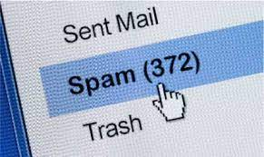

# Gmail Spam Detection

[Click here for the audio](https://drive.google.com/drive/folders/1HBRN420a-ZxXOX79oKJlPIjXlaTUXdbA?usp=sharing)

## Spam Detection
Whenever you submit details about your email or contact number on any platform, it has become easy for those platforms to market their products by advertising them by sending emails or by sending messages directly to your contact number. This results in lots of spam alerts and notifications in your inbox. This is where the task of spam detection comes in.

Spam detection means detecting spam messages or emails by understanding text content so that you can only receive notifications about messages or emails that are very important to you. If spam messages are found, they are automatically transferred to a spam folder and you are never notified of such alerts. This helps to improve the user experience, as many spam alerts can bother many users.

## GMAIL, YAHOO AND OUTLOOK CASE STUDY
<b>Gmail</b>

Google data centers use thousands of rules to filter spam emails. They provide the weightage to different parameters, and basedc on that; they filter the mails. Google's spam classsifier is said to be a <i>state of an art technique</i> that uses various techniques like Optical character recognition, linear regression, and a combination of various neural networks.

<b>Yahoo</b>

Yahoo mail is the world's first free webmail service provider, which still has more than 320 million users. They have their own filtering techniques to categorize the emails. Yahoo's basic methods are URL filtering, email content and spam complaints from users. <b>Unlike Gmail, Yahoo filte r emails messages by domain and not the IP address. </b> Yahoo provides custom filtering options to users as well to directky send the mail in the junk folders.

<b>Outlook</b>

Microsoft-owned mailing platform widely used among professionals. In 2013, Microsoft renamed the Hotmail and Windows Live Mail to Outlook. At present, the outlook has mor ethan 400 million active users. Outlook has its own distinctive feature based on which it filters every incoming mail. Based on their official website, they have provided the list of spam filters they use to send any mail in the junk folder, which includes:
- Safe senders list
- Safe recipients list
- Blocked senders list
- Blocked Top-level domains list
- Blocked encodings list 

## SUMMARY

As we saw, we used previously collected data in order to train the model and predicted the category for new incoming emails. This indicate the importance of tagging the data in right way. One mistake can make your machine dumb, e.g In your gmail or any other email account when you get the emails and you think it is a spam but you choose to ignore, may be next time when you see that email, you should report that as a spam. This process can help a lot of other people who are receiving the same kind of email but not aware of what spam is. Sometimes wrong spam tag can move a genuine email to spam folder too. So, you have to be careful before you tag an email as a spam or not spam.
