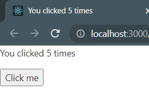

<h1 align="center">  Basic Hooks in React </h1>

## What are Hooks in React?

- Hooks were introduced in 16.8 version of React.
- They are basically logical,functional components that allow to access various lifecycle features of React like states without having to define a class.
- Hooks are also backward-compatible i.e. they are devoid of any breaking changes.
  Example: useState,useEffect and useReducers are some popularly known and used React Hooks.

### What is useState in React ?

- useState in React is a type of Hook that declares a state variable.
- It acts as a storage to preserve the value of that state during numerous function calls.
- The initial value of the state is passed as an argument to the useState Hook.
- useState returns the current state along with the function that updates it.

### When do we use useState ?

- When we want to add a state to our functional component.
- When we want the state to keep updating its value during function calls.
- To create a piece of state without using a class component.

#### Example 1: Implementing a Counter using useState

```
//To use useState you need to import useState from react as shown below:
import React, { useState } from 'react';

function App() {
  // Declare a new state variable, which we'll call "count"
  const [count, setCount] = useState(0);

  return (
    <div>
      <p>You clicked {count} times</p>
      <button onClick={() => setCount(count + 1)}>
        Click me
      </button>
    </div>
  );
}

export default App;

```

This code would render the following output:


#### Example 2: Using Multiple State Variables and adding a Toggle Button using useState

```

import React, { useState } from "react";
function App() {
  const [isRed, setRed] = useState(false);
  const [count, setCount] = useState(0);

  const increment = () => {
    setCount(count + 1);
    setRed(!isRed); //toggle
  };

  return (
    <>
      <h1 style={{ color: isRed ? "red" : "" }}>Color changes</h1>
      <button onClick={increment}>Increment</button>
      <h1>You have clicked {count} times.</h1>
    </>
  );
}

export default App;

```

This code would render the following output:


### What is useEffect in React ?

- useEffect in React is a type of Hook that lets us perform a side effects in functional components.
- Various examples of such side Effects include data fetching, setting up a subscription, and manually changing the DOM in React components.
- Placing useEffect inside the component lets us access a state variable or any props right from the effect.

### When do we use useEffect ?

- When we want our component to do something even after rendering.
- When we want to perform Data Fetching.
- When we want to call an API.

#### Example 1: Changing DOM using useEffect

```
import React, { useState, useEffect } from 'react';

function App() {
  const [count, setCount] = useState(0);

  useEffect(() => {
    document.title = `You clicked ${count} times`;
  });

  return (
    <div>
      <p>You clicked {count} times</p>
      <button onClick={() => setCount(count + 1)}>
        Click me
      </button>
    </div>
  );
}

export default App;

```

This code would render the following output:



#### Example 2: Timed change of State using useEffect

```
import React, { useState, useEffect } from "react";

function App() {
  const [isLoading, setIsLoading] = useState(true);

  useEffect(() => {
    // Wait for 3 seconds
    setTimeout(() => {
      setIsLoading(false);
    }, 3000);
  }, []);

  return isLoading ? (
    // If page is still loading
    <h1>Please wait ...Page is Loading</h1>
  ) : (
    <h1>Welcome...Page is Loaded</h1>
  );
}

export default App;


```

This code would render the following output:

 (./assets/useEffect_example2_part_2.JPG)

#### Example 3: API Calls and Data Fetching using useEffect

```
import React, { useState, useEffect } from "react";
const App = () => {
  const APP_ID = "Your ID";
  const APP_KEY = "Your API Key";

  const [recipes, setRecipes] = useState([]);
  const [search, setSearch] = useState("");
  const [query, setQuery] = useState("");

  useEffect(() => {
    getRecipes();
  }, [query]);

  const getRecipes = async () => {
    const response = await fetch(
      `https://api.edamam.com/search?q=${query}&app_id=${APP_ID}&app_key=${APP_KEY}`
    );
    const data = await response.json();
    console.log(data);
    setRecipes(data.hits);
  };

  const updateSearch = (e) => {
    setSearch(e.target.value);
  };

  const getSearch = (e) => {
    e.preventDefault();
    setQuery(search);
    setSearch("");
  };
  return (
    <div >
      <br></br>
      <form  onSubmit={getSearch}>
        <input

          type="text"
          onChange={updateSearch}
          placeholder="Enter item to search recipe"
        />
        <button  type="submit">
          <svg
            xmlns="http://www.w3.org/2000/svg"
            width="16"
            height="16"
            fill="currentColor"
            className="bi bi-search"
            viewBox="0 0 16 16"
          >
            <path d="M11.742 10.344a6.5 6.5 0 1 0-1.397 1.398h-.001c.03.04.062.078.098.115l3.85 3.85a1 1 0 0 0 1.415-1.414l-3.85-3.85a1.007 1.007 0 0 0-.115-.1zM12 6.5a5.5 5.5 0 1 1-11 0 5.5 5.5 0 0 1 11 0z"></path>
          </svg>
        </button>
      </form>
      <div >
        {recipes.map((recipe) => (
          <div>
            <h1>{recipe.recipe.label}</h1>
            <p>Cuisine: {recipe.recipe.cuisineType}</p>
            <p>Calories: {recipe.recipe.calories}</p>
          </div>
        ))}
        <br />
        <br />
      </div>
    </div>
  );
};
export default App;

```

This code would render the following output:


### Some Rules and Facts of Using Hooks

- Always call React Hooks only at the Top level i.e. before any early returns.
- Always call Hooks from Functional Components and not from class components.
- Don’t call Hooks inside loops, conditions, or nested functions.
- React relies on the order in which Hooks are called.
- We can use multiple State or Effect Hooks in a single component.
