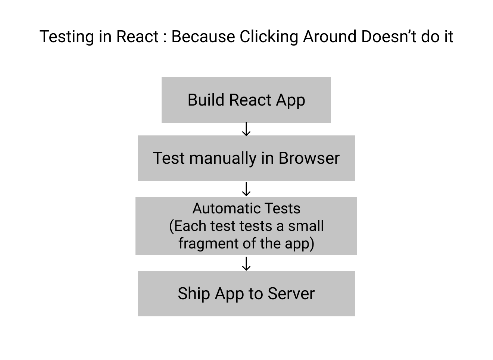

<h1 align='center'>Testing in React</h1>

## What is Testing ?

Testing can be defined as the procedure to make sure a software application or product behaves just the way it is supposed to do.Testing the code is essesntial before deployment.



## Required Testing Tools:

- **Test Runner**:  
  A test runner executes tests and provides validation library which performs comparisons and potentially throw some errors (if any). For example: **Jest** provides popular Javascript testing tools.

  ```
  npm install jest
  ```

- **Testing Utilities**:
  Testing utilities "simulate" the React Application i.e. it mounts components and allows developers to dig into the DOM (Document Object Module). For example: **React Test Utils** or **Enzyme** are some of the popular testing utilities in React.

  ```
  npm install --save enzyme react-test-renderer enzyme-adapter-react-16
  ```

## What to Test?

| Do's                                               | Don'ts                              |
| -------------------------------------------------- | ----------------------------------- |
| :heavy_check_mark: Do test isolated units          | :x: Don't test the library          |
| :heavy_check_mark: Do test the Conditional outputs | :x: Dont't test complex connections |

## What are the types ?

There are a few ways to test React components and applications.

- **Rendering component trees**:
  in a simplified test environment and asserting on their output.

- **End-to-End Tests**:
  Running a complete app in a realistic browser environment (also known as “end-to-end” tests).
  This documentation section focuses on testing strategies for the first case. While full end-to-end tests can be very useful to prevent regressions to important workflows, such tests are not concerned with React components in particular, and are out of the scope of this section.

- **Test-Driven Development**:  
  Test-Driven Development is a development process in which tests are written for tasks before writing the code to implement those tasks. These tests can check for different scenarios and edge cases as well.

- **Unit Test**:
  A Unit Test is a type of test that covers a "unit" of code - that is usually a single function, independently from the rest of the program. Ideally, a test program is made to run that runs all the unit tests and lets the tester know which one failed and which one succeeded.

Example: React Testing Library builds on top of DOM Testing Library by adding APIs for working with React components.is a very light-weight solution for testing React components. It provides light utility functions on top of react-dom and react-dom/test-utils, in a way that encourages better testing practices.

```
npm install --save-dev @testing-library/react
```

## Benefits of the Testing

- Testing helps developers catch errors and faulty conclusions before they make any major impact.
- Logging plays an important role in testing any application.It helps to describe events that have occurred while running the React App .
- Code Reviews benefit the testing procedure to promote best programming practices and thereby help to prepare code for production.
- Testing is done to ensure that your app will work as intended for your end users. Having tests will make your app more robust and less error prone. It is a way to verify that the code is doing what the developers intended.

## References

- https://reactjs.org/docs/testing.html
