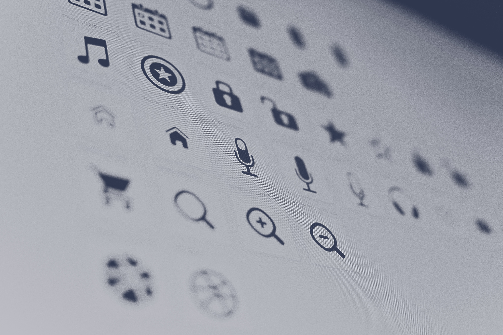
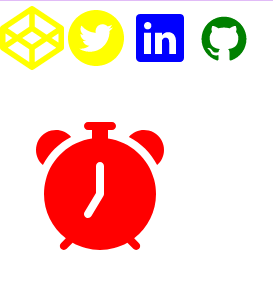

# React Icons - A Begineer's Guide


Image from [Unsplash by Harpal Singh](https://images.unsplash.com/photo-1506729623306-b5a934d88b53?ixlib=rb-1.2.1&ixid=MnwxMjA3fDB8MHxzZWFyY2h8MXx8aWNvbnN8ZW58MHx8MHx8&auto=format&fit=crop&w=700&q=60)

## Introduction
Images or pictures are said to speak a thousand words. For example, when you see a logo, it tells you the name of who or what it is representing, characteristics that make them unique and so on. These images include Icons.

Icon in computing is a pictogram or ideogram displayed on a computer screen in order to help the user navigate a computer system. The icon itself is a quickly comprehensible symbol of a software tool, function, or a data file, accessible on the system and is more like a traffic sign than a detailed illustration of the actual entity it represents.

## Most common icon libraries

- [Ant Design Icons](https://ant.design/components/icon/)
- [Bootstrap Icons](https://getbootstrap.com/docs/4.0/extend/icons/)
- [Devicons](https://devicon.dev/)
- [Feather](https://feathericons.com/)
- [Flat Color Icons](https://icons8.com/icon/pack/logos/color)
- [Font Awesome](https://fontawesome.com/v4.7/icons/)
- [Game Icons](https://game-icons.net/)
- [Github Octicons icons](https://primer.style/octicons/)
- [Grommet Icons](https://icons.grommet.io/?)
- [Ionicons](https://ionic.io/ionicons)
- [Material Design icons](https://fonts.google.com/icons?selected=Material+Icons)
- [Remix Icon](https://remixicon.com/)
- [Typicons](https://www.s-ings.com/typicons/)
- [Weather Icons](https://erikflowers.github.io/weather-icons/)

These all are the icons which is commonly used in our projects. So, what are **react icons** ?

## What are React Icons?

React icons is a opensource library that has brought all the icon library we have listed above into a single package, so that we can use all icons in a major/minor projects by installing a single package only.

## Why to use React Icons?

There are a number of reason, why should we use react icons in our react projects.Some of them are -

- The very first reason is, sometimes we can't find all our required icons in a single library. For this, we have to install may libraries. React icons saves our life to get multiple icon packages inside one.

- React Icons utilizes ES6 imports that allows you to include only the icons that your project is using.

- React Icons has been designed and tailored to react. This means that there will be little or no issues using it in your react project.

- It is pretty straight forward and easy to use.

## How to use React Icons?

You have just a few steps left to implement react icons in your project. Don't worry!, we well cover here with these mentioned steps.

- ### Step 1 : Installation

    If your react project has not been set-up, follow these steps 
    - Open terminal and execute the code
    ```js
    npx create-react-app learning
    ```

    else start installation of react icons from here
    ```js
    npm install react-icons --save
    ```

    Learn more about react-icons package [here](https://www.npmjs.com/package/react-icons)

- ### Step 2 : Choose icon(s) to use in your project

    We will use four icons from four different libraries
    
    1. `AiFillTwitterCircle` from `Ant Design Icons`
    2. `DiGithubBadge` from `Devicons`
    3. `FaCodepen` from `Font Awesome`
    4. `IoLogoLinkedin` from `Ionicons`

- ### Step 3 : Import icons 

    Import icons in the same way you import components in react. Open your `src/App.js` file and import as follows
    ```js
    import { FaCodepen } from "react-icons/fa";
    import { AiFillTwitterCircle } from "react-icons/ai";
    import { DiGithubBadge } from "react-icons/di";
    import { IoLogoLinkedin } from "react-icons/io";
    ```
    Importing in curly braces {} because each library might have many exports from single file and what we are importing is not the default export of that file.

**Note :-** React icons is used in a similar way we use component after importing in a file.

- ### Step 4 : Using icons inside

    After importing the icons, it's time to use it. Hence first clean everything inside return statement of `function App`.

    Your function App should look like this
    ```js
    function App(){
        return (
            <div>
                <AiFillTwitterCircle />
                <FaCodepen />
                <IoLogoLinkedin />
                <DiGithubBadge />
            </div>
        )
    }
    ```

- ### Step 5 : Result

    Now it's time to view the result of our work. For this open your terminal and execute the code -

    ```js
    npm start
    ```
    And then checkout the localhost in your favourite browser by typing inside search box `localhost:3000`, if it automatically not start.

### Output


## Styling React Icons

Yay! We have done so many things but it's not the end. Just look at the output, these are in black and white color. What if we want a coloured logo? Well there is a way we can style them through two methods-

1. Using React Context API
2. Using Styled component

### 1. Using React Context API

You can choose to style more than one of the icons at a time or style it individually. You just need to wrap all the icons you want to style in the tag. Steps to follow

- Import this API in the top of the file i.e, `App.js` as
    ```js
    import { IconContext } from "react-icons";
    ```
    - ### Styling more than one icon 

        Let's wrap the first 2 icons and assign a className to it like so: 

        ```js
        <IconContext.Provider value={{ className: "top-react-icons" }}>
            <FaCodepen />
            <AiFillTwitterCircle />
        </IconContext.Provider>
        ```

        Now in App.css, let's style them as
        ```js
        .top-react-icons{
            color: yellow;
        }
        ```

        `Output`
        
        

    - ### Styling single icon

        Let's take the other two icons for this

        ```js
        <IconContext.Provider value={{ color: "blue" }}>
        <IoLogoLinkedin />
        </IconContext.Provider>
        <IconContext.Provider value={{ color: "green" }}>
        <DiGithubBadge />
        </IconContext.Provider>
        ```

        `Output`

        


### 2. Using styled component

In this tutorial, I'm assuming you know [styled component](https://styled-components.com/), if no then don't worry, our method 1 for styling icons works just fine.

In case if you want to explore styled component, visit [here](https://styled-components.com/)

- Install styled components
```js
npm install --save styled-components
```

- Import styled-component
```js
import styled from 'styled-components'
```

- Import some new icons or you can try on previous one

```js
import { BsFillAlarmFill } from "react-icons/bs"
```

- Use icon inside a new div
```js
<div>
    <BsFillAlarmFill />
</div>
```

- Now, go to the last line of the file and write the code to style the new icon.

```js
const Alarm = styled(BsFillAlarmFill)`
  color: red;
  transform: scale(2);
  margin: 5%;
`;
```

- Rename your `<BsFillAlarmFill>` with the name you have given in styled component i.e, `<Alarm />`

```js
<div>
    <Alarm />
</div>
```

- Output



### Your final code inside App.js should look like this

```js
import React from "react";
import styled from 'styled-components'
import { IconContext } from "react-icons";
import { FaCodepen } from "react-icons/fa";
import { AiFillTwitterCircle } from "react-icons/ai";
import { DiGithubBadge } from "react-icons/di";
import { IoLogoLinkedin } from "react-icons/io";
import { BsFillAlarmFill } from "react-icons/bs"
import "./App.css";

function App() {
  return (
    <div>
      <IconContext.Provider value={{ className: "top-react-icons" }}>
        <FaCodepen />
        <AiFillTwitterCircle />
      </IconContext.Provider>

      <IconContext.Provider value={{ color: "blue" }}>
        <IoLogoLinkedin />
      </IconContext.Provider>
      <IconContext.Provider value={{ color: "green" }}>
        <DiGithubBadge />
      </IconContext.Provider>

      <div>
        <Alarm />
      </div>
    </div>
  );
}

export default App;

const Alarm = styled(BsFillAlarmFill)`
  color: red;
  transform: scale(2);
  margin: 5%;
`;
```

## Conclusion
Phew! We have covered so many things. Now, it's time to apply all these things in your beautiful projects. Hopw you have learnt everything about React Icons.

__Contributor__ : [Harsh Anand](https://www.github.com/its-me-Harsh-Anand)